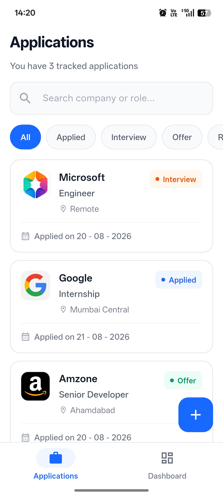
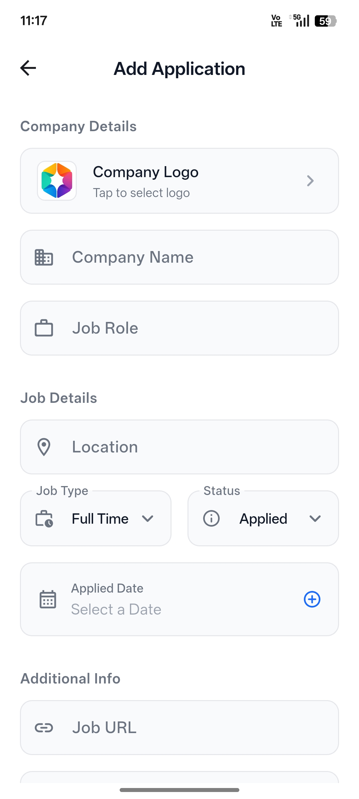
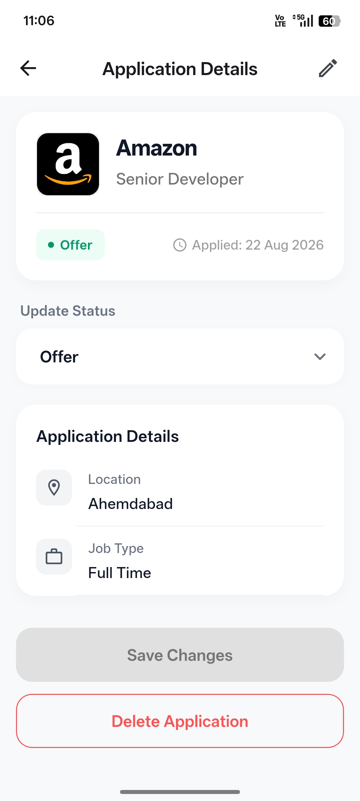

# Job Application Tracker

A Flutter application for managing and tracking job applications throughout the hiring process.

Users can add job applications, update their status, search and filter records, edit application details, and keep their job search organized in one place.

## Screenshots

| Applications | Add Application                                     | Application Details |
| --- |-----------------------------------------------------| --- |
|  |  |  |


## Features

* Add and manage job applications
* View application details
* Edit existing applications
* Delete applications
* Update application status
* Search applications
* Filter applications
* Track applied date, job type, location, and other details
* Handle loading, empty, and error states
* Synchronize application state using Riverpod
* Store application data in Firebase Firestore

## Tech Stack

* **Flutter** — Application UI and cross-platform development
* **Dart** — Application logic
* **Riverpod** — State management
* **Firebase Firestore** — Cloud database
* **Firebase Core** — Firebase initialization and integration

## Architecture

The application separates UI, state management, and data access responsibilities.

```text
UI
 │
 ▼
Riverpod Provider
 │
 ▼
Repository
 │
 ▼
Firebase Firestore
```

### UI Layer

Responsible for displaying application data and handling user interactions.

### Provider Layer

Manages application state using Riverpod and coordinates operations requested by the UI.

### Repository Layer

Handles data operations between the application and Firebase Firestore.

### Model Layer

Represents job application data and handles conversion between Dart objects and Firestore-compatible data.

## Project Structure

```text
lib/
├── models/
├── providers/
├── repositories/
├── screens/
├── widgets/
├── firebase_options.dart
└── main.dart
```

The exact structure may contain additional files and folders based on individual features.

## Data Flow

A typical operation follows this flow:

```text
User Action
    │
    ▼
Flutter UI
    │
    ▼
Riverpod Provider
    │
    ▼
Repository
    │
    ▼
Firebase Firestore
    │
    ▼
Updated Provider State
    │
    ▼
UI Rebuild
```

This keeps Firebase-related operations separate from UI code and makes application state easier to manage.

## Getting Started

### Prerequisites

Before running the project, make sure you have:

* Flutter SDK
* Dart SDK
* Android Studio or VS Code
* A configured Firebase project
* An Android emulator or physical device

Check your Flutter installation:

```bash
flutter doctor
```

### Clone the Repository

```bash
git clone https://github.com/umbraxvoid/job-application-tracker.git
cd job_application_tracker
```

### Install Dependencies

```bash
flutter pub get
```

## Firebase Setup

This project uses Firebase Firestore.

Configure Firebase for the project using FlutterFire CLI:

```bash
flutterfire configure
```

Make sure the Firebase configuration required for your target platform is available before running the application.

## Run the Project

```bash
flutter run
```

## Code Quality

Run Flutter's static analyzer:

```bash
flutter analyze
```

The project should complete analysis without reported issues.

## Release Build

To generate a release APK:

```bash
flutter build apk --release
```

## What This Project Demonstrates

This project demonstrates practical Flutter development concepts including:

* Flutter UI development
* Riverpod state management
* Firebase Firestore integration
* CRUD operations
* Repository pattern
* Reactive state updates
* Form handling and validation
* Navigation between screens
* Search and filtering
* Loading and error-state handling
* Separation of UI and data-access logic

## Possible Improvements

Potential future additions include:

* User authentication
* Application statistics and analytics
* Interview reminders
* Sorting options
* More advanced filtering
* Automated tests
